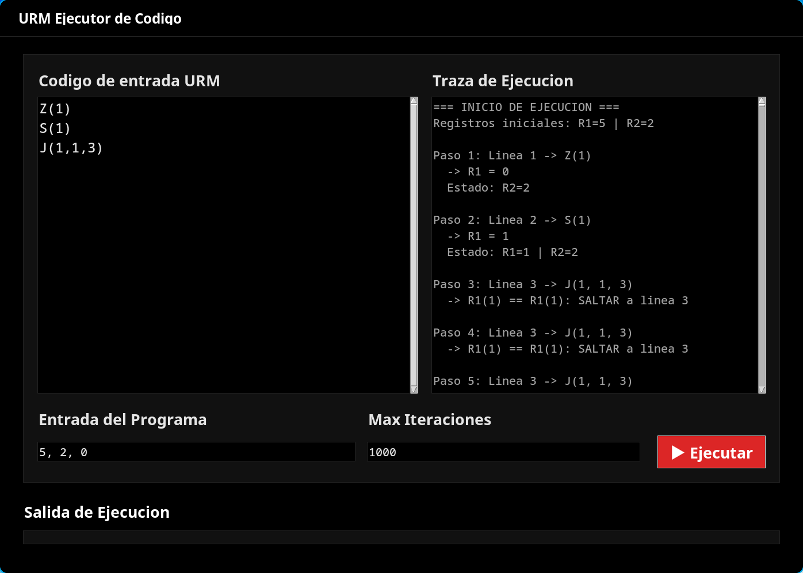

# URM Simulator

A desktop application to write, compile and execute programs for the **Unlimited Register Machine (URM)**, a minimal model of computation used in computability theory. It includes a hand-written compiler (lexer + LL(1) recursive-descent parser), a runtime with step-by-step execution tracing, and a Tkinter GUI.



*Execution trace of `Z(1); S(1); J(1,1,3)` — an infinite loop stopped by the max-iterations guard.*

## What is a URM?

A URM is an abstract machine with an unbounded set of registers `R1, R2, R3, ...`, each holding a natural number. Despite having only four instructions, it is Turing-complete:

| Instruction | Name | Effect |
|---|---|---|
| `Z(n)` | Zero | `Rn := 0` |
| `S(n)` | Successor | `Rn := Rn + 1` |
| `T(m, n)` | Transfer | `Rn := Rm` |
| `J(m, n, q)` | Jump | If `Rm == Rn`, jump to instruction `q`; otherwise continue |

A program is a numbered list of instructions, one per line. Execution starts at instruction 1 and halts when control flows past the last instruction. The result is read from `R1`.

**Example - addition (`R1 + R2`):**

```
J(2,3,5)
S(1)
S(3)
J(1,1,1)
```

More sample programs (including exponentiation `x^y`) are in [`program_examples.txt`](program_examples.txt).

## Architecture

```
src/
├── compiler/
│   ├── lexer/       # Tokenizer: normalizes input and produces (type, value) tokens
│   └── parser/      # LL(1) recursive-descent parser: validates instruction
│                    #   names, arity and syntax, and builds the program AST
├── runtime/         # Executes the AST over a defaultdict register bank,
│                    #   with a max-step guard against infinite loops and a
│                    #   human-readable execution trace
└── app/             # Tkinter GUI: program editor, register input,
                     #   compile/run controls and trace viewer
```

- **Lexer** (`src/compiler/lexer/tokenizer.py`): strips whitespace and case, then emits tokens for instruction letters, numbers, parentheses and commas.
- **Parser** (`src/compiler/parser/parser.py`): single-token-lookahead (LL(1)) parser. Checks that each instruction is one of `Z/S/T/J`, enforces its arity (1, 1, 2 and 3 arguments respectively) and reports syntax errors with line context. Produces a list of instruction objects (`src/compiler/parser/implementations/instructions.py`) implementing a common `Instruction` interface.
- **Runtime** (`src/runtime/run_program.py`): initializes registers from user input, executes the AST instruction by instruction, records a full trace of every step and register state, and aborts cleanly if a configurable `max_steps` limit is exceeded (infinite-loop protection).

## Usage

Run from source:

```sh
uv venv
uv pip install -e .
python main.py
```

In the GUI: write or load a URM program, set the initial register values, and run it. The trace panel shows each executed instruction and the register state after it, which makes the tool useful for teaching and debugging computability exercises.

## Building a Standalone Executable

**1. Install `uv`**

- **macOS (Homebrew):**
  ```sh
  brew install uv
  ```

- **Linux, macOS (official installer):**
  ```sh
  curl -LsSf https://astral.sh/uv/install.sh | sh
  ```

**2. Set up the environment**

```sh
uv venv
uv pip install -e .
```

**3. Build with PyInstaller**

```sh
./.venv/bin/pyinstaller --name URM_Machine --onefile --windowed main.py
```

The final executable will be located in the `dist/` directory.

## Requirements

- Python 3.10+
- [uv](https://github.com/astral-sh/uv) (dependency management and packaging)
