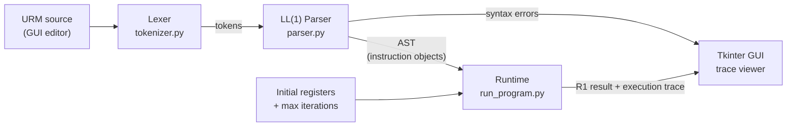

# URM Simulator

A desktop application to write, compile and execute programs for the **Unlimited Register Machine (URM)**, a minimal model of computation used in computability theory. It includes a hand-written compiler (lexer + LL(1) recursive-descent parser), a runtime with step-by-step execution tracing, and a Tkinter GUI.


*Execution trace of `Z(1); S(1); J(1,1,3)` — an infinite loop stopped by the max-iterations guard.*

## What is a URM?

A URM is an abstract machine with an unbounded set of registers `R1, R2, R3, ...`, each holding a natural number. Despite having only four instructions, it is Turing-complete:

| Instruction | Name | Effect |
|---|---|---|
| `Z(n)` | Zero | `Rn := 0` |
| `S(n)` | Successor | `Rn := Rn + 1` |
| `T(m, n)` | Transfer | `Rn := Rm` |
| `J(m, n, q)` | Jump | If `Rm == Rn`, jump to instruction `q`; otherwise continue |

## Language reference

Syntax rules, as implemented by the compiler:

- One instruction per line. Blank lines are ignored.
- Instructions are **case-insensitive**: `z(1)`, `Z(1)` and `  Z ( 1 )  ` are equivalent (whitespace is discarded by the lexer).
- Arguments are comma-separated **positive integers**. `0` is rejected: there is no register `R0` and no instruction `0`.
- Arity is enforced: `Z` and `S` take 1 argument, `T` takes 2, `J` takes 3. Anything else is a syntax error.
- Syntax errors are reported with the (1-based) instruction number where parsing failed.

## Execution model

- **Input**: the comma-separated values from the *Entrada del Programa* field are loaded into `R1, R2, ...` in order. Every other register starts at `0`. An empty field means all registers start at `0`.
- **Start**: execution begins at instruction 1.
- **Jumps**: `J(m, n, q)` uses 1-based instruction numbers. Jumping to itself is legal (and loops).
- **Halt**: the machine halts when control flows past the last instruction — including a jump to a `q` greater than the program length, which is the conventional way to exit early.
- **Result**: read from `R1` when the machine halts.
- **Non-termination**: the halting problem being what it is, the runtime takes a *Max Iteraciones* limit (default 1000). If the program exceeds it, execution aborts and the trace ends with `LIMITE DE ITERACIONES ALCANZADO`.

Every step is logged to the trace panel: instruction executed, its effect, and the register state after it.

**Example — addition (`R1 := R1 + R2`)**, with input `5, 2`:

```
J(2,3,5)    # while R2 != R3 (counter):
S(1)        #   R1 += 1
S(3)        #   R3 += 1
J(1,1,1)    # unconditional jump back (R1 == R1 is always true)
```

`R3` counts from 0 up to `R2`, incrementing `R1` once per step; when `R2 == R3` the first jump targets instruction 5, past the end, halting with `R1 = 7`. (Note: `#` comments above are for illustration — the real syntax is one bare instruction per line.)

More sample programs (including exponentiation `x^y`) are in [`program_examples.txt`](program_examples.txt).

## Architecture

Each stage does one thing and hands a single well-defined value to the next:



```
src/
├── compiler/
│   ├── lexer/       # Tokenizer
│   └── parser/      # LL(1) parser + instruction implementations
├── runtime/         # Executor with tracing and step limit
└── app/             # Tkinter GUI
```

| Stage | File | Input → Output |
|---|---|---|
| Lexer | `src/compiler/lexer/tokenizer.py` | Source lines → `(type, value)` tokens. Normalizes case, drops whitespace and empty lines. Token types: `LETTER`, `NUMBER`, `BEGIN_P`, `END_P`, `COMMA`. |
| Parser | `src/compiler/parser/parser.py` | Tokens → AST, or an error string. Single-token lookahead; validates instruction names, parenthesization, argument type/positivity and arity. The AST is a list of `(instruction, args)` pairs. |
| Instructions | `src/compiler/parser/implementations/instructions.py` | `Z`, `S`, `T`, `J` classes behind a common `Instruction` interface; each implements `exec(registers, args)`. `J.exec` returns the jump target (or `False`), the only instruction that affects control flow. |
| Runtime | `src/runtime/run_program.py` | AST + initial registers + step limit → `(R1, trace, steps)`. Registers are a `defaultdict(int)`, so the register set is genuinely unbounded. |
| GUI | `src/app/urm.py` | Editor, register input, iteration limit, run button, trace panel and result label. Compilation errors surface as dialogs; runtime output fills the trace. |

## Usage

Run from source:

```sh
uv venv
uv pip install -e .
python main.py
```

In the GUI: write or load a URM program, set the initial register values, and run it. The trace panel shows each executed instruction and the register state after it, which makes the tool useful for teaching and debugging computability exercises.

## Building a Standalone Executable

**1. Install `uv`**

- **macOS (Homebrew):**
  ```sh
  brew install uv
  ```

- **Linux, macOS (official installer):**
  ```sh
  curl -LsSf https://astral.sh/uv/install.sh | sh
  ```

**2. Set up the environment**

```sh
uv venv
uv pip install -e .
```

**3. Build with PyInstaller**

```sh
./.venv/bin/pyinstaller --name URM_Machine --onefile --windowed main.py
```

The final executable will be located in the `dist/` directory.

## Requirements

- Python 3.10+
- [uv](https://github.com/astral-sh/uv) (dependency management and packaging)
